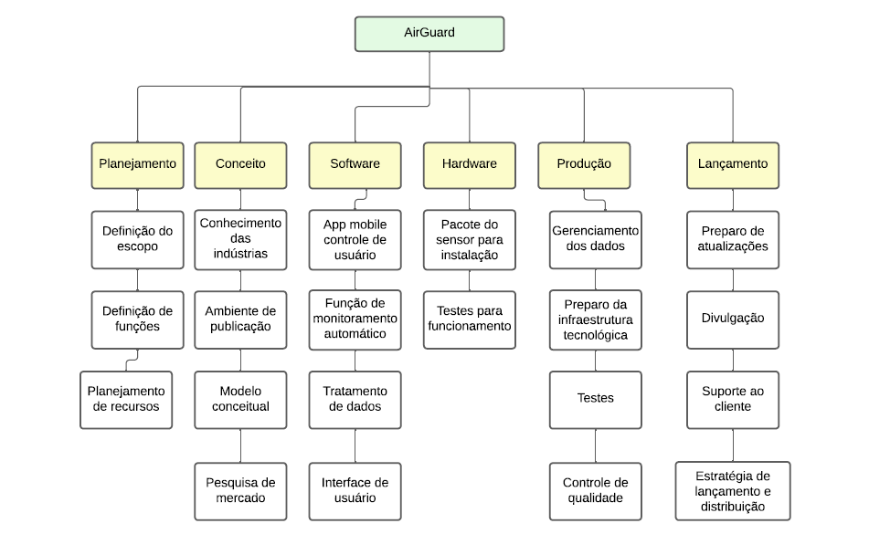

# Planejamento

 A fase de planejamento na gerência de projetos é um momento onde os detalhes do projeto são minuciosamente definidos para garantir uma execução bem-sucedida. 
Durante essa etapa, os gerentes de projeto e suas equipes elaboram um plano abrangente que aborda aspectos como cronograma, orçamento, recursos necessários, riscos identificados e métodos de controle. 
O objetivo é criar uma estrutura que guiará as atividades ao longo do projeto, garantindo que metas sejam alcançadas de maneira eficiente. 
O plano de projeto não apenas define as tarefas específicas e suas interdependências, mas também estabelece critérios de sucesso e indicadores de desempenho. 
A qualidade do planejamento influencia diretamente a capacidade da equipe em cumprir prazos, alocar recursos eficientemente e lidar com desafios que possam surgir durante a execução.

# Estrutura do Documento

- [Fase de Planejamento](#planejamento)
- [Estrutura Analítica do Projeto](#estrutura-analítica-do-projeto)
- [Matriz de Responsabilidades](#matriz-de-responsabilidades)
- [Escopo do Projeto](#escopo-do-projeto)
- [Cronograma do Projeto](#cronograma-do-projeto)
- [Orçamento do Projeto](#orçamento-do-projeto)
- [Planos de Gerenciamento](#planos-de-gerenciamento)
  - [Plano de Comunicação](#plano-de-comunicação)
  - [Plano de Qualidade](#plano-de-qualidade)
  - [Plano de Riscos](#plano-de-riscos)
  - [Plano de Aquisição](#plano-de-aquisição)
  - [Plano de Gestão de RH](#plano-de-gestão-de-rh)
- [Documentos](#documentos)
  - [Aquisição de Produtos](#aquisição-de-produtos)
  - [Checklist de Qualidade](#checklist-de-qualidade)
  - [Escopo, Cronograma e Orçamento](#escopo-cronograma-e-orçamento)
  - [Estrutura Analítica do Projeto (EAP)](#estrutura-analítica-do-projeto-eap)
  - [Matriz de Responsabilidades (RACI)](#matriz-de-responsabilidades-raci)
  - [Plano de Gerência de Comunicação](#plano-de-gerenciamento-de-comunicação)
  - [Plano de Gerenciamento de Riscos](#plano-de-gerenciamento-de-riscos)

# Estrutura Analítica do Projeto

A Estrutura Analítica de Projeto (EAP) para monitorar a qualidade do ar de uma área específica é composta por três etapas principais: inicial, intermediária e final. Na etapa inicial, são definidos os orçamentos dos itens e o planejamento de funções. A etapa intermediária envolve o desenvolvimento do software, a montagem do hardware e os testes de funcionamento. Na etapa final, ocorre o desenvolvimento da aplicação mobile, o ajuste fino deste aplicativo e os testes finais para garantir a integridade do sistema. Cada etapa é essencial para assegurar a eficiência e eficácia do projeto, desde o planejamento até a implementação e testes finais.

> **EAP:**
> 

# Matriz de Responsabilidades

A Matriz de Responsabilidades é uma ferramenta para definir e indicar as responsabilidades de cada membro da equipe em relação às atividades do projeto. 
Também conhecida como RACI (Responsável, Aprovador, Consultado e Informado), essa matriz atribui papéis específicos a cada envolvido, indicando quem é responsável pela execução de uma tarefa, quem deve aprovar, quem precisa ser consultado e quem deve ser mantido informado. 
Ao criar uma visão visual e estruturada das responsabilidades, a matriz RACI minimiza ambiguidades e conflitos de papel.
Essa ferramenta não apenas esclarece as expectativas em termos de contribuições individuais, mas também contribui para um ambiente de trabalho mais organizado e transparente, resultando em uma gestão de projeto mais eficaz e bem-sucedida.

> Informações Adicionais:
> * **R**esponsible -> Executor (pessoa(s) que executará(ão)/desenvolverá(ão) a atividade)
> * **A**ccountable -> Responsável (pessoa responsável por aprovar a atividade)
> * **C**onsulted   -> Consultado (especialista consultado sobre a atividade ou parte dela)
> * **I**nformed    -> Informado (pessoas interessadas no projeto que devem ser informadas sobre a execução).
> 
> Link de auxílio: https://www.forbes.com/advisor/business/raci-chart/

# Escopo do Projeto

Orçamentos dos itens | Etapa inicial  
Planejamento de funções | Etapa inicial  
Desenvolvimento do Software | Etapa intermediaria  
Montagem do Hardware | Etapa intermediaria  
Teste de Funcionamento | Etapa intermediaria  
Desenvolvimento de aplicação mobile | Etapa final  
Ajuste fino de aplicativo móvel | Etapa final  
Testes finais | Etapa final  

> O escopo do projeto define os limites, objetivos e entregáveis do projeto, estabelecendo clareza sobre o que será realizado e o que está excluído do escopo. 

# Cronograma do Projeto

......  COLOQUE AQUI O SEU TEXTO ......

> O cronograma do projeto fornece uma representação temporal detalhada de todas as atividades, marcos e eventos ao longo do ciclo de vida do projeto. 
> Elaborado durante o planejamento, o cronograma é uma ferramenta que oferece uma visão das interdependências entre as tarefas, alocando recursos e definindo prazos para as entregas.
> Utilizando técnicas como a análise de rede (PERT/CPM) e estimativas de duração, o cronograma ajuda na identificação de caminhos críticos, permitindo aos gestores de projeto otimizar recursos, antecipar potenciais atrasos e tomar decisões. 
> Além disso, o cronograma serve como um guia para monitorar o progresso, comunicar efetivamente com a equipe e as partes interessadas, e ajustar estratégias para garantir a conclusão bem-sucedida do projeto dentro dos prazos estabelecidos.

# Orçamento do Projeto

O orçamento do projeto envolve a estimativa e alocação de recursos financeiros necessários para a execução bem-sucedida do projeto, abrangendo custos diretos e indiretos, despesas operacionais, investimentos em equipamentos, pessoal, entre outros. 

O arquivo do Orçamento está disponível ao final da página como arquivo .pod, utilize do ProjectLibre para visualizar

# Planos de Gerenciamento

......  COLOQUE AQUI O SEU TEXTO ......

> Os planos de gerenciamento do projetos consolidam as diretrizes e estratégias para a execução bem-sucedida de um empreendimento. 
> Ele abrange diversos aspectos, como escopo, cronograma, custos, riscos, qualidade, recursos humanos, comunicação e aquisições, proporcionando uma visão abrangente e integrada do projeto. 
> Este plano funciona como um guia mestre que orienta a equipe de projeto e as partes interessadas ao longo do ciclo de vida do projeto, estabelecendo expectativas, responsabilidades e processos. 
> Além disso, serve como um instrumento de comunicação, alinhando as expectativas entre os membros da equipe e as partes interessadas, mitigando riscos e fornecendo uma estrutura sólida para a tomada de decisões. 

## Plano de Comunicação

......  COLOQUE AQUI O SEU TEXTO ......

> O Plano de Comunicação estabelece estratégias e diretrizes para facilitar a troca de informações entre os membros da equipe e as partes interessadas. 
> Este plano abrange aspectos como os meios de comunicação, a frequência das atualizações, os canais de distribuição de informações e os responsáveis pela comunicação. 
> Uma comunicação eficiente não apenas previne mal-entendidos e conflitos, mas também fortalece o engajamento da equipe e o apoio das partes interessadas. 

## Plano de Qualidade

O Plano de Qualidade auxilia a garantir que as entregas do projeto atendam aos padrões de qualidade definidos. 
Usamos de diversas normas para garantir a qualidade do produto em diversas áreas, usamos da ISO 8573, ISO/IEC 25010 entre outros.
É possível ver em maiores detalhes no link anexo ao fim da página.

> Referência - Conceitual
> * https://www.researchgate.net/publication/230636169_Software_Quality_Assurance

> Normas de Qualidade:
> * https://repositorium.uminho.pt/bitstream/1822/27266/1/Tese_MEI_PG19676_Juliana%20Oliveira.pdf
> * https://cin.ufpe.br/~processos/TAES3/Livro/00-LIVRO/07-Normas%20ISO%20e%20Qualidade%20de%20Software-v6_CORRIGIDO.pdf

> Processos de Garantia da Qualidade de Software
> * https://ceur-ws.org/Vol-3200/paper22.pdf
> * https://citeseerx.ist.psu.edu/document?repid=rep1&type=pdf&doi=d6bd60206282a2d4449e414e81a703612ef78a0c
> * https://www.testbytes.net/blog/quality-assurance-process-methodology/
> * https://www.projectmanager.com/blog/quality-assurance-and-testing

## Plano de Riscos

O plano de riscos busca antecipar, avaliar e mitigar os desafios potenciais que podem surgir ao longo do projeto. Este documento estratégico oferece uma visão global dos riscos, categorizando-os e delineando estratégias para lidar com cada uma das possíveis adversidades. O plano de riscos não apenas destaca os perigos em potencial, mas também estabelece respostas e estratégias de contingência.
É possível ver nosso Plano de Risco no link de anexo ao final da página.

## Plano de Aquisição

O Plano de Aquisições define o processo relacionado à aquisição de bens e serviços necessários para a execução do projeto. Gerenciado no software ProjectLibre, o plano de aquisição segue os custos gerados assim como quantidades necessárias e cada ponto do projeto que se encontra necessário realizar a aquisição.

# Documentos

## Aquisição de Produtos

- [Declaração de Escopo](artefatos/Grupo_5.pod)

## Checklist de Qualidade

- [Checklist de Qualidade](artefatos/Checklist.pdf)

## Escopo, Cronograma e Orçamento

- [Cronograma e Orçamento do Projeto](artefatos/Grupo_5.pod)

## Estrutura Analítica do Projeto (EAP)

- [Estrutura Analítica do Projeto](artefatos/Declaracao_de_escopo.docx)

## Matriz de Responsabilidades (RACI)

- [Declaração de Escopo](artefatos/Matriz_RACI.pdf)

## Plano de Gerenciamento de Comunicação

- [Plano de Gerenciamento de Comunicação](artefatos/Plano_Comunicacao.pdf)

## Plano de Gerenciamento de Riscos

> Você deve preencher o seguinte documento:
- [Plano de Gerenciamento de Riscos](artefatos/Lista_de_Riscos.pdf)
