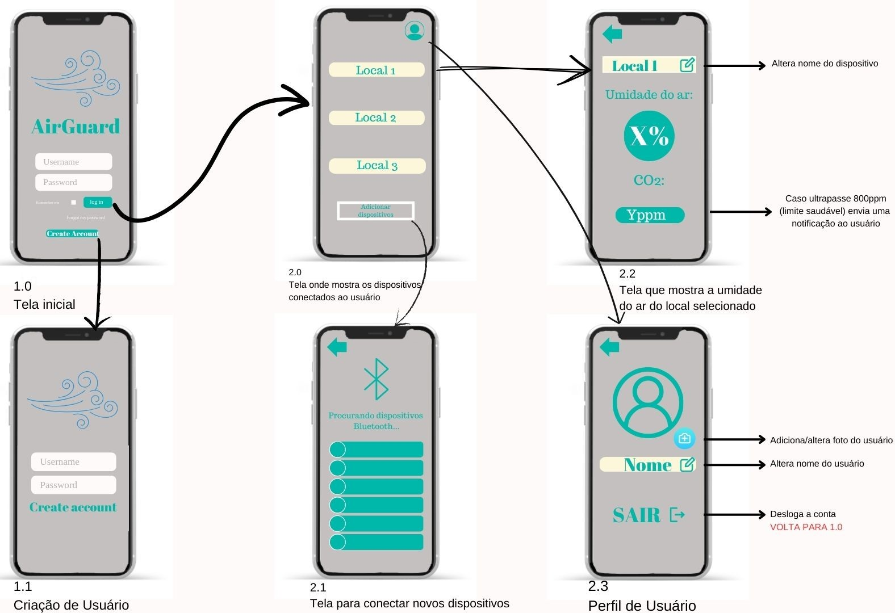
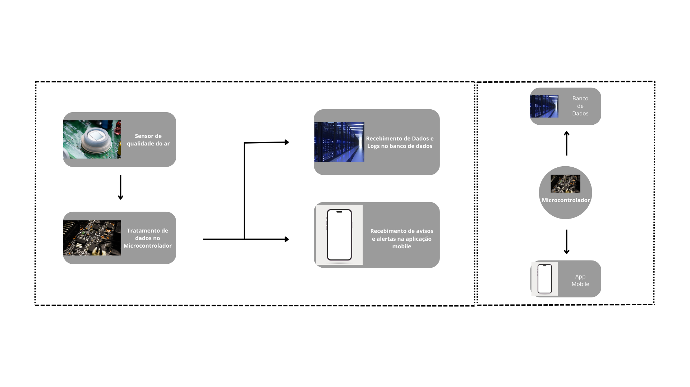
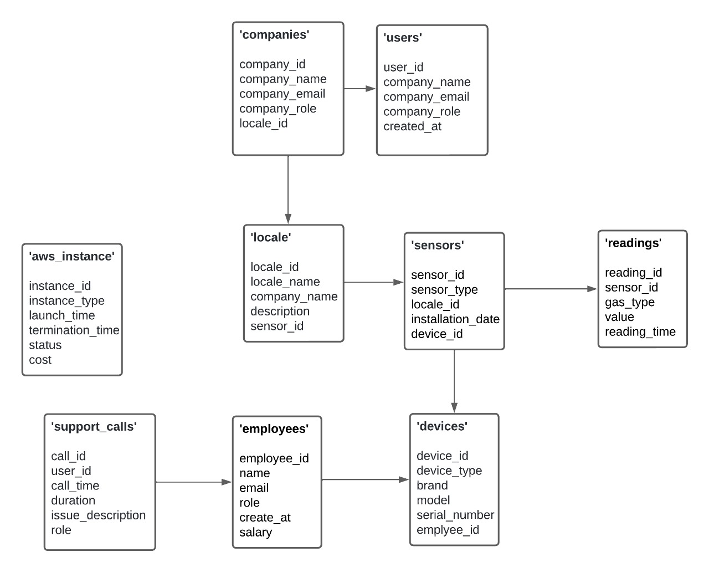

# Execução

A fase de execução na gerência de projetos é o momento em que as atividades planejadas são realizadas. 
Durante essa etapa, os membros da equipe executam suas tarefas de acordo com o cronograma estabelecido, os recursos são alocados conforme as necessidades e as comunicações são fundamentais para garantir que todos estejam alinhados com os objetivos. 
O gerente de projeto atua na coordenação das atividades, resolução de problemas e na gestão de mudanças inesperadas. 
Além disso, o monitoramento constante é essencial para garantir que o projeto esteja avançando conforme o planejado, e ajustes são feitos conforme necessário. 
 A fase de execução é o momento em que o trabalho tangível é realizado, e a eficácia nessa etapa contribui diretamente para o sucesso geral do projeto.

# Estrutura do Documento

- [Fase de Execução](#execução)
- [Interfaces do Sistema](#interfaces-do-sistema)
- [Modelagem da Solução](#modelagem-da-solução)
  - [Arquitetura da Solução](#arquitetura-da-solução)
  - [Diagrama de Classes](#diagrama-de-classes)
  - [Persistência dos Dados](#persistência-dos-dados)

# Interfaces do Sistema

# Modelagem da Solução

A modelagem de software envolve a criação de representações abstratas que capturam a estrutura, comportamento e interações do software a ser desenvolvido. Esses modelos servem como guias visuais que auxiliam na compreensão e comunicação entre os membros da equipe de desenvolvimento. No contexto do projeto AirGuard, um dispositivo que controla a qualidade do ar, a modelagem de software desempenha um papel crucial para garantir que todas as funcionalidades e requisitos sejam claramente definidos e compreendidos.

## Arquitetura da solução

A arquitetura de software define a organização de um sistema, definindo seus componentes e suas relações.Abrange escolhas de design que influenciam aspectos como desempenho, escalabilidade, segurança e manutenibilidade do software. 
A arquitetura de software serve como um mapa que orienta as decisões de desenvolvimento, fornecendo uma visão global que facilita a compreensão e a colaboração entre membros da equipe. 
Uma arquitetura bem projetada promove a modularidade, facilitando a evolução e a manutenção do sistema ao longo do tempo.

A Arquitetura selecionada foi a de microserviços devido sua simplicidade e menor complexidade de implementação, assim como foi deifinido que o fluxo de dados seria baixo, a arquitetura de microserviços foi uma escolha mais racional por parte do grupo.

> 

## Diagrama de Classes

O diagrama de classes fornece uma representação visual das estruturas e relações entre as classes em um sistema orientado a objetos. 

> **Diagrama de Classes:**
> Tabela 'companies':
>
>    Atributos: company_id, company_name, company_email, company_role, locale_id
>    Relações: Cada empresa (companies) pode estar associada a vários locais (locale).
>
>Tabela 'users':
>
>    Atributos: user_id, company_name, company_email, company_role, created_at
>    Relações: Os usuários (users) estão vinculados a empresas (company_name e company_email).
>
>Tabela 'locale':
>
>    Atributos: locale_id, locale_name, company_name, description, sensor_id
>    Relações: Cada local (locale) está vinculado a uma empresa e pode ter vários sensores (sensors).
>
>Tabela 'sensors':
>
>    Atributos: sensor_id, sensor_type, locale_id, installation_date, device_id
>    Relações: Os sensores (sensors) estão instalados em locais (locale_id) e podem estar associados a dispositivos (devices).
>
>Tabela 'readings':
>
>    Atributos: reading_id, sensor_id, gas_type, value, reading_time
>    Relações: Cada leitura (readings) está associada a um sensor (sensor_id).
>
>Tabela 'devices':
>
>    Atributos: device_id, device_type, brand, model, serial_number, employee_id
>    Relações: Os dispositivos (devices) podem estar associados a sensores (sensor_id) e são mantidos por funcionários (employees).
>
>Tabela 'employees':
>
>    Atributos: employee_id, name, email, role, create_at, salary
>    Relações: Funcionários (employees) são responsáveis por dispositivos (devices).
>
>Tabela 'support_calls':
>
>    Atributos: call_id, user_id, call_time, duration, issue_description, role
>    Relações: Chamadas de suporte (support_calls) são registradas por usuários (user_id).
>
>Tabela 'aws_instance':
>
>    Atributos: instance_id, instance_type, launch_time, termination_time, status, cost
>    Relações: Esta tabela parece ser autônoma, relacionada à gestão de instâncias AWS.
>
> **Exemplo de diagrama de Classes**:
> 
